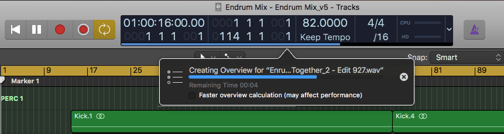

# git-logic-init
[](https://github.com/NaanProphet/git-logic-init/actions/workflows/main.yml)

Retrofit init script for versioning Apple Logic projects with Git.

Tested with Logic Pro X 10.4.8+.

## Why

Apple Logic modifies audio files by embedding overview data (thumbnails) inside them. Logic recalculates these overviews if a file's modified date timestamp changes—even if the checksums match.



This may not seem like such a bad thing (it's rather fast) except that...**rescanning changes the checksums!!**


Since Git does not preserve timestamps, any clone will cause Logic to recalculate overviews, essentially changing every audio file anytime a repo is cloned. This creates a nightmare for version control and increases the size of the Git repo unnecessarily!

## Solution

1. Use [Git LFS](https://github.com/git-lfs/git-lfs) to store large files and keep the repo size small (LFS is based on SHA-256 checksums)
2. Use commit hooks and [Git Store Meta](https://github.com/danny0838/git-store-meta) to preserve and restore timestamps

Since Git commit hooks are scripts, they must—by design—be re-configured each time a repository is created/cloned. Running this `init.sh` script once after the clone configures everything automatically.


## Requirements and Dependencies

* Mac OS X, tested on 10.14.6 Mojave thru 14.2.1 Sonoma
* Homebrew [link](https://brew.sh)
  * Prompts if not installed
* Git (>= 2.9)
  * Formerly higher than default version bundled with Mac OS X (Sonoma is 2.43.0)
  * Prompts to upgrade if not installed
* Git LFS
  * Prompts if not installed `brew install git-lfs`
* Git Store Meta [fork/link](https://github.com/NaanProphet/git-store-meta)
  * Custom version to accommodate DST
  * Automatically patched and bundled via CI script

## Usage

### Clone Existing Repo

To re-initialize a repo that already has the custom `.githooks` folder, simply run `sh init.sh` again. The script will prompt if any dependencies are missing (git-lfs, etc.)

### New Repo

* Create a new folder `mkdir myrepo && cd myrepo`
* Download the latest `init.sh` script from GitHub Releases
```
curl -s -L -OO \
https://github.com/NaanProphet/git-logic-init/releases/latest/download/init{.sh,.sh.sha256} \
&& shasum -a256 -c init.sh.sha256
```

* Checksum verification should pass saying `init.sh: OK`
* Run `sh init.sh`. This will do the following:
  * Setup the commit hooks
  * Create the commit-able `.githooks` folder
  * Run `git config core.hooksPath .githooks` at the end to setup the custom hooks folder

### Updating Existing Repo

To update an existing repo to the latest version of `git-logic-init`, simply run the following.

```
curl -s -L -OO \
https://github.com/NaanProphet/git-logic-init/releases/latest/download/init{.sh,.sh.sha256} \
&& shasum -a256 -c init.sh.sha256
```

Then run `sh init.sh`

## ⏭ 🔆 ⏮ DST Ritual: Re-init Twice a Year

The day Daylight Savings Time changes (either in the spring or the fall) you will find a lot of files "changing" because their timestamps supposedly have changed.

If you have not yet opened Logic after DST has changed, simply run `sh init.sh` manually again before opening the project.

If Logic has already recalculated overviews, that means some files themselves have changed. To undo/restore to the original:

1. First restore the files using `git restore <files>`
2. Then re-run `sh init.sh` the day after the DST change

For more info see, the [How Daylight Savings Time Affects Modified Time](#how-daylight-savings-time-affects-modified-time) section.

## Side Effects

1. Initializing Git LFS for the first time adds some `[filter "lfs"]` entries to your `~/.gitconfig` that automatically checkout LFS files when cloning any repo.

```[filter "lfs"]
  process = git-lfs filter-process
  required = true
  clean = git-lfs clean -- %f
  smudge = git-lfs smudge -- %f
```
This behavior can be disabled inline by turning the smudge filter off in the clone command, if desired.
```$ GIT_LFS_SKIP_SMUDGE=1 git clone <repo>```

2. At a local repo level, the default Git hooks directory will change from `.git/hooks` to `.githooks` so that the scripts can be committed.

Use `git rev-parse --git-path hooks` to display the current hooks directory for debugging.

## Default Rules

### Ignore

The following files/folders are automatically added to the repo's `.gitignore` to prevent too much chatter. Loosely based on https://sound.stackexchange.com/a/38454.

| Name | Description |
| --- | --- |
| `.DS_Store` | Excluded because even opening a folder in Finder updates it. It's a tiny file, but updating it all the time unnecessarily increases the size of the Git repo! The tradeoff however is Finder colors will not stored—use a README instead. |
| `Freeze Files` | Files in this folder can change a lot, so assume owner of repo has access to all plugins so that Freeze Files are not needed. Otherwise, manually zip up the Freeze Files folder to upload them.
| `Undo Data.nosync` | Internal project file that keeps track of Undo History. Sometimes these files are 14 MB each, and by default Logic X will keep the last 10. Git *is* for version control so in-flight Undos are not needed.
| `Project File Backups` | Every time a project is saved, a backup is created. No need for intermediate versions, again, use Git to commit/restore actual checkpoints.
| `Autosave` | The folder where Logic records every edit until you use the Save command again. Not needed because it is assumed the person has saved before making a new commit. |
| `*.rxdoc` | iZotope RX documents. Sometimes I use RX to make changes in the Audio Files folder, and for convenience these are excluded from being picked up. |

### LFS

The following filetypes will be tracked by Git LFS after initialization:

* Audio Extensions
  * `*.wav`
  * `*.aif`
  * `*.aiff`
  * `*.mp3`
  * `*.m4a`
  * `*.alac` (Apple Lossless)
  * `*.aifc` (AIFF Compressed)
  * `*.au` (Audacity raw audio)
* Archives
  * `*.zip`
  * `*.gz`
  * `*.tgz`
* Logic Files
  * `ProjectData` (the actual project database file)

## Caveats

### LFS Storage Concerns

On most Git platforms LFS files seem to continue being stored even after commits are rewritten to dereference them.

For example, here's output force pushing a blank repo to an Azure Devops remote in attempt to "start over" again.

```
$ git push origin
Uploading LFS objects: 100% (175/175), 3.9 GB | 0 B/s, done
Counting objects: 476, done.
Delta compression using up to 4 threads.
Compressing objects: 100% (475/475), done.
Writing objects: 100% (476/476), 48.65 MiB | 7.14 MiB/s, done.
Total 476 (delta 24), reused 0 (delta 0)
remote: Analyzing objects... (476/476) (6396 ms)
remote: Storing packfile... done (614 ms)
remote: Storing index... done (52 ms)
$
```

0 B/s to upload 3.9 GB!? Oh reeeealy.... This can work both for/against your workflow depending on what you're doing.

It seems currently, the only way to actually remove LFS files is by deleting the project and creating a new one. This is [documented in GitHub](https://help.github.com/en/github/managing-large-files/removing-files-from-git-large-file-storage#git-lfs-objects-in-your-repository) and GitLabs seems to work the same way. There's actually an [open issue from 2017 on GitLabs](https://gitlab.com/gitlab-org/gitlab/issues/17711) to prune unreferenced LFS files more proactively.

### How Daylight Savings Time Affects Modified Time

While changing timezones does not usually change audio files, changing DST does. As a result, if a project that was worked on in June was reopened in January, then it would appear all the files would change.


Modified timestamps are set using [epoch time](https://en.wikipedia.org/wiki/Unix_time), a number in milliseconds. Although the epoch time does not change when DST turns on/off, it appears Logic thinks the file has shifted +/- 1 hour. Why, black box.

In order to adjust/account for this, the original timestring format `YYYY-MM-DDTHH:MM:SSZ` is customized to `YYYY-MM-DDTHH:MM:SSZDST[01]` where
* `DST0` indicates the file was modified when DST was off
* `DST1` indicates the file was modified when DST was in effect

For details, see the test cases inside [dst-hack.t](test/dst-hack.t). These are run automatically with Travis CI.


If only Logic drove off of the actual epoch timestamp ... but alas, it appears it wasn't designed with this edge case in mind.
